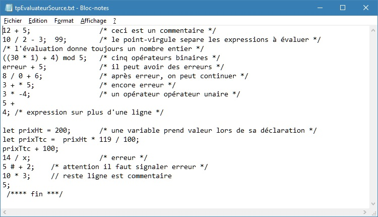
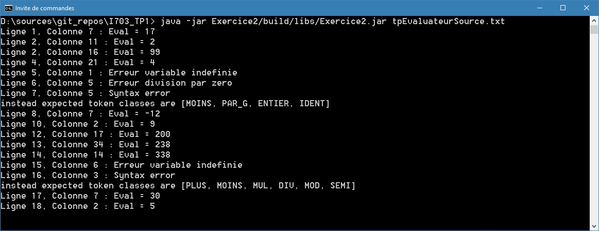

# TP Compilation « l'évaluateur »

## TP Compilation : Evaluateur d'expressions arithmétiques infixes

L'objectif du TP est de se familiariser avec les outils JFlex et CUP.

### Exercice 1 : 

Ecrire un évaluateur d'expressions arithmétiques infixes sur les nombres entiers. 
Vous devez écrire l'analyseur lexical avec JFlex et l'analyseur syntaxique avec CUP.

Exemple de fichier source de l'évaluateur : 

```
12 + 5; 		/* ceci est un commentaire */
10 / 2 - 3;  99; 	/* le point-virgule sépare les expressions à évaluer */
/* l'évaluation donne toujours un nombre entier */
((30 * 1) + 4) mod 2;	/* cinq opérateurs binaires */
erreur + 5;		/* il peut avoir des erreurs */
8 / 0 + 6;		/* erreur, on doit pouvoir continuer */
3 + * 5;		/* encore erreur */
3 * -4;			/* notez l'opérateur unaire */
5 +
4; /* expression sur plus d'une ligne */
```

A propos l'opérateur unaire `-`, vous trouverez [ici un exemple](http://www2.cs.tum.edu/projects/cup/docs.php#cpp) 
de déclaration de précédence et d'utilisation dans une règle de production. 

Liens utiles :  
- JFlex : http://www.jflex.de  
- CUP : http://www2.cs.tum.edu/projects/cup  
- CUP User's Manual : http://www2.cs.tum.edu/projects/cup/docs.php

### Exercice 2 :

Une extension utile à votre évaluateur consiste à accepter des variables précédement déclarées, dans les expression. 
Modifier votre analyseur lexicale et syntaxique pour tenir compte de cette extension.

Exemple de source de l'évaluateur : 

```
let prixHt = 200; /* déclaration et initialisation */
let prixTtc =  prixHt * 119 / 100;
-prixTtc + 100;  /* unaire qui précéde une variable */
14 / x;          /* erreur */
5 # + 2;         /* erreur, il faut le signaler */
10 * 3;          // reste ligne est commentaire
5;
/* fin */
```

Vous trouverez ci-joint :  
- Un fichier de test : tpEvaluateurSource.txt.
- Une copie d'écran du résultat

Fichier source :  
  

Résultat :  
  

### Remarques sur CUP

- Pour déclarer certaines variables (par exemple une Hashtable pour les symboles) dans votre analyseur, vous devez inclure ces déclaration dans un "bloc" `action code {: ... :};` . Similaire au "bloc" `parser code {: ... :};` Voir une explication dans : http://www2.cs.tum.edu/projects/cup/docs.php#code_part
- Pour traiter les erreurs de logique (division par zéro ou variable non déclarée) vous pouvez soit :
    1. déclarer des variables qui garderont l'état de l'analyse à un moment donnée. Il faut donc affecter des valeurs à ces variables en cas d'erreur et vérifier leur valeur par la suite.
    2. une meilleure solution consiste à déclarer (dans le fichier .cup) le symbole expr ayant comme valeur un type (une classe à déclarer, par exemple Texpr) différent d'Integer. Dans cette classe vous pouvez déclarer, en plus d'un attribut valeur, les attributs nécessaires pour signaler une situation d'erreur.
- Dernier point. Vous pouvez, dans CUP, accéder aux valeurs *left* et *right* de Symbole à travers les variables (génerées par CUP) `xxxleft` et `xxxright` où xxx est le "label" du symbole.  
Exemple :  
`expression ::= bla1 bla2 POINT_VIRGULE:pv {: System.out.println("ligne : "+pvleft;) :}`
